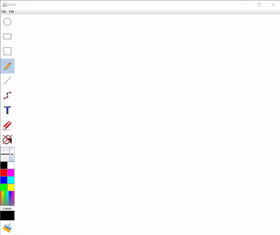
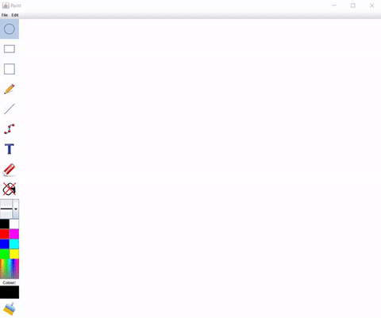
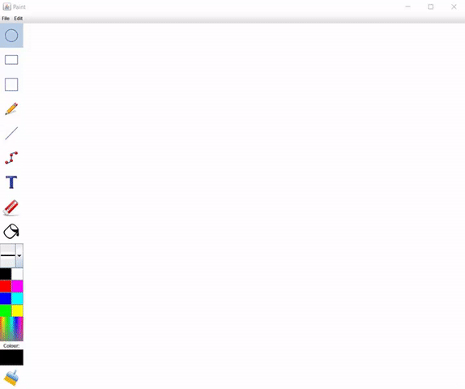
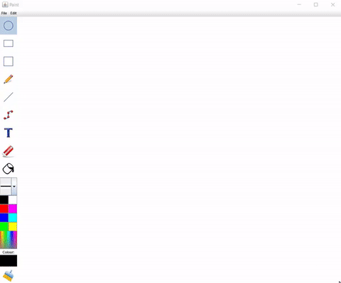
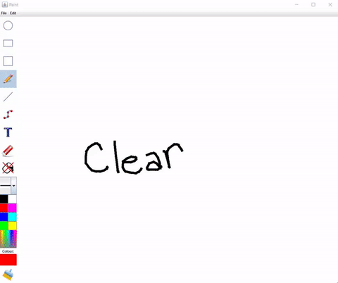

# Paint
A Java application inspired by Microsoft Paint. Written and developed by a group of 4 people in Java using Git branches and Scrum. The application features common tools such as shape tools, pencil, polyline, line thickness, and colour selection.

GIFS
------------

